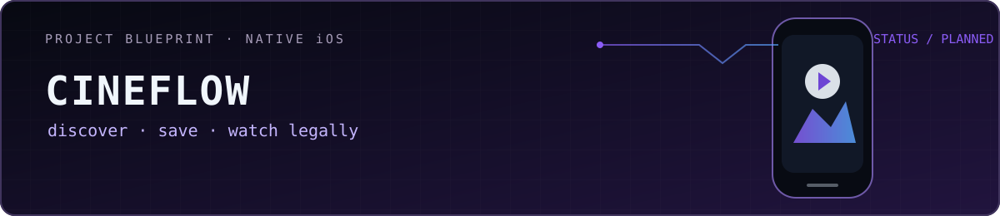
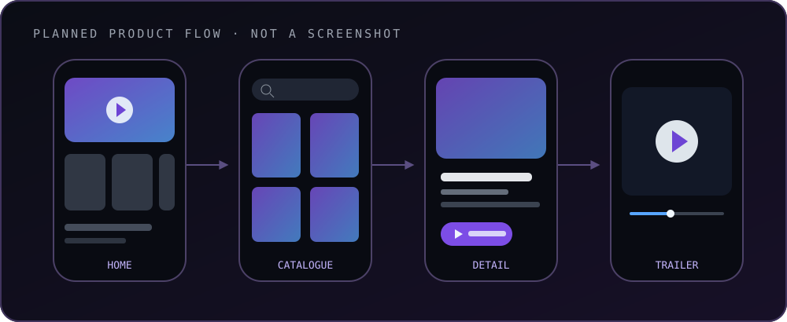

  

  <strong>Русский</strong> · <a href="./README_EN.md">English</a> · <a href="https://github.com/mrjakeball/portfolio">Все проекты</a>

# CineFlow iOS

Будущее нативное приложение-каталог: подборки фильмов, поиск, карточка, избранное и воспроизведение легальных трейлеров в одном спокойном iOS-интерфейсе.

> [!IMPORTANT]
> Разработка ещё не начата. Это честный проектный план, а не демонстрация готового приложения; визуал ниже показывает структуру сценария, а не реальные экраны.

| Проектный срез | Решение |
|---|---|
| Платформа | iPhone · нативная iOS-разработка |
| Текущий этап | Подготовка объёма, архитектуры и этапов |
| Планируемый стек | `Swift` `UIKit` `URLSession` `AVPlayer` `MVVM` |
| Контент | Метаданные каталога + трейлеры / public-domain видео |
| Исходники | Появятся после создания Xcode-проекта |

  

## Один понятный маршрут

Первая версия не пытается стать «своим Netflix». Её задача — довести до конца один цельный путь: открыть подборку, найти фильм, изучить карточку и запустить трейлер.

### 01 · Основа

- нижняя навигация: Главная, Каталог, Избранное, Профиль;
- коллекции постеров и экран подробностей;
- загрузка каталога через API и понятные loading/error states.

### 02 · Личное пространство

- поиск и фильтры;
- избранное и история просмотра;
- восстановление позиции трейлера на устройстве.

### 03 · Качество

- MVVM и отдельный слой сервисов;
- кэширование изображений и отмена лишних запросов;
- unit-тесты ключевой логики, аккуратные empty states и VoiceOver-проверка.

## Что будет считаться готовым

Витрина сменит статус только после реальной сборки в Xcode, проверки в iPhone Simulator, появления собственных скриншотов и воспроизводимых тестов. До этого CineFlow остаётся прозрачным roadmap-проектом.

  <a href="https://github.com/mrjakeball/portfolio">← Вернуться к списку проектов</a>

